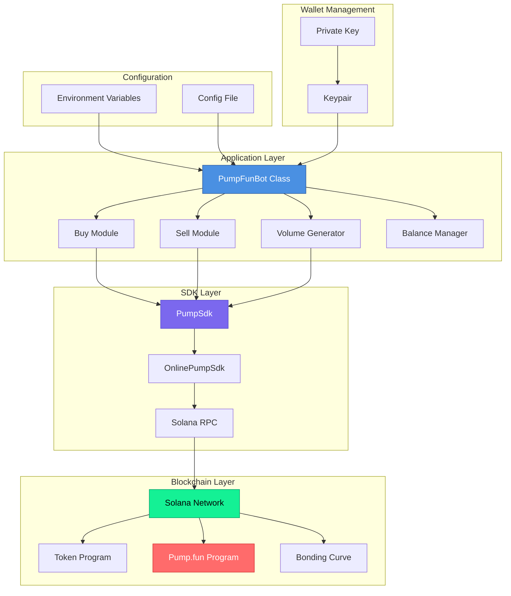
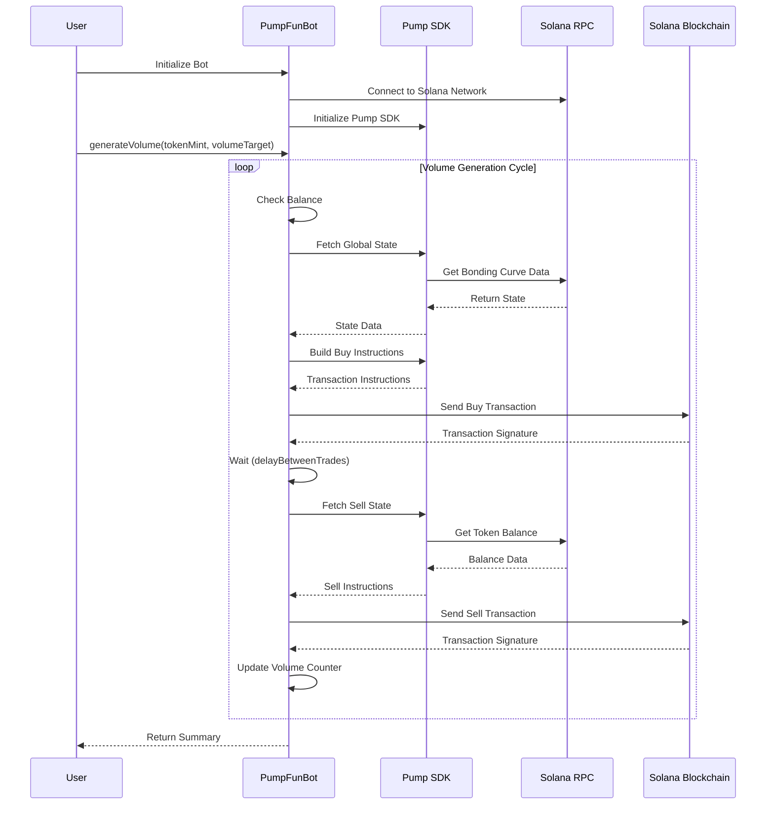
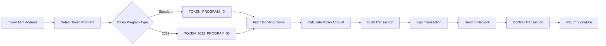

# Pump.fun Volume Bot

A professional Solana trading bot for automated token trading on [pump.fun](https://pump.fun). This bot enables automated buying, selling, and volume generation for tokens on the Solana blockchain using the Pump.fun SDK.

## 🚀 Features

- **Automated Trading**: Buy and sell tokens on pump.fun programmatically
- **Volume Generation**: Automatically generate trading volume through repeated buy/sell cycles
- **Token Program Detection**: Automatically detects and supports both `TOKEN_PROGRAM_ID` and `TOKEN_2022_PROGRAM_ID`
- **Slippage Protection**: Configurable slippage tolerance for safe trading
- **Balance Management**: Real-time balance checking and validation
- **Error Handling**: Robust error handling with detailed logging
- **Transaction Tracking**: View all transactions on Solscan with direct links
- **Configurable Delays**: Customizable delays between trades to avoid rate limiting

## 📋 Table of Contents

- [Architecture](#architecture)
- [Installation](#installation)
- [Configuration](#configuration)
- [Usage](#usage)
- [API Reference](#api-reference)
- [Safety & Security](#safety--security)
- [Contributing](#contributing)
- [License](#license)

## 🏗️ Architecture

### System Architecture Diagram



### Component Flow



### Data Flow



## 📦 Installation

### Prerequisites

- Node.js (v18 or higher)
- npm or yarn
- A Solana wallet with SOL balance
- A Solana RPC endpoint (public or private)

### Setup

1. **Clone the repository**
   ```bash
   git clone https://github.com/yourusername/pump-volume-bot.git
   cd pump-volume-bot
   ```

2. **Install dependencies**
   ```bash
   npm install
   ```

3. **Configure environment variables**
   ```bash
   cp env.example .env
   ```
   
   Edit `.env` and add your configuration:
   ```env
   PRIVATE_KEY=your_base58_encoded_private_key_here
   RPC_URL=https://api.mainnet-beta.solana.com
   DEFAULT_SLIPPAGE=1
   ```

4. **Get your private key**
   - Export from Phantom/Solflare wallet
   - Or generate a new wallet using Solana CLI
   - **Important**: Never commit your private key to version control!

## ⚙️ Configuration

### Environment Variables

| Variable | Description | Required | Default |
|----------|-------------|----------|---------|
| `PRIVATE_KEY` | Base58 encoded Solana wallet private key | Yes | - |
| `RPC_URL` | Solana RPC endpoint URL | No | `https://api.mainnet-beta.solana.com` |
| `DEFAULT_SLIPPAGE` | Default slippage tolerance (%) | No | `1` |

### Recommended RPC Providers

For better performance and reliability, consider using a paid RPC provider:

- **Helius**: `https://mainnet.helius-rpc.com/?api-key=YOUR_KEY`
- **QuickNode**: `https://YOUR_ENDPOINT.solana-mainnet.quiknode.pro/YOUR_KEY/`
- **Alchemy**: `https://solana-mainnet.g.alchemy.com/v2/YOUR_KEY`

### Config File (`src/config.js`)

The config file allows you to customize:
- RPC URL
- Default slippage tolerance
- Transaction commitment level
- Retry settings
- Volume bot parameters

## 💻 Usage

### Basic Usage

```javascript
import { PumpFunBot } from './src/index.js';

// Initialize the bot
const bot = new PumpFunBot();

// Buy tokens
const buySignature = await bot.buy(
  '8mb5FoFwKtdPByA9mrjeDAXyz3aeiyBYcRquib4baaV4', // token mint
  0.1, // SOL amount
  1    // slippage %
);

// Sell tokens
const sellSignature = await bot.sell(
  '8mb5FoFwKtdPByA9mrjeDAXyz3aeiyBYcRquib4baaV4', // token mint
  1000, // token amount
  1     // slippage %
);

// Generate volume
const result = await bot.generateVolume(
  '8mb5FoFwKtdPByA9mrjeDAXyz3aeiyBYcRquib4baaV4', // token mint
  10,   // target volume in SOL
  0.1,  // amount per transaction
  1,    // slippage %
  2000  // delay between trades (ms)
);
```

### Running the Bot

```bash
# Run the bot
npm start

# Run in development mode (with auto-reload)
npm run dev
```

### Example: Volume Generation

```javascript
const bot = new PumpFunBot();

const result = await bot.generateVolume(
  'YOUR_TOKEN_MINT_ADDRESS',
  5.0,    // Generate 5 SOL of volume
  0.05,   // 0.05 SOL per transaction
  1,      // 1% slippage
  2000    // 2 second delay between trades
);

console.log('Volume Generation Complete!');
console.log(`Generated: ${result.generatedVolume} SOL`);
console.log(`Transactions: ${result.transactionCount}`);
console.log(`Duration: ${result.duration}s`);
```

## 📚 API Reference

### `PumpFunBot`

Main bot class for interacting with pump.fun.

#### Constructor

```javascript
const bot = new PumpFunBot();
```

Initializes the bot with wallet and RPC connection from environment variables.

#### Methods

##### `buy(tokenMint, solAmount, slippage, tokenProgram)`

Buy tokens on pump.fun.

**Parameters:**
- `tokenMint` (string): The mint address of the token
- `solAmount` (number): Amount of SOL to spend
- `slippage` (number, optional): Slippage tolerance percentage (default: 1)
- `tokenProgram` (PublicKey, optional): Token program ID (auto-detected if not provided)

**Returns:** `Promise<string>` - Transaction signature

**Example:**
```javascript
const signature = await bot.buy('TOKEN_MINT', 0.1, 1);
```

##### `sell(tokenMint, tokenAmount, slippage, tokenProgram)`

Sell tokens on pump.fun.

**Parameters:**
- `tokenMint` (string): The mint address of the token
- `tokenAmount` (number): Amount of tokens to sell
- `slippage` (number, optional): Slippage tolerance percentage (default: 1)
- `tokenProgram` (PublicKey, optional): Token program ID (auto-detected if not provided)

**Returns:** `Promise<string>` - Transaction signature

**Example:**
```javascript
const signature = await bot.sell('TOKEN_MINT', 1000, 1);
```

##### `generateVolume(tokenMint, volumeTarget, perTransactionAmount, slippage, delayBetweenTrades)`

Generate trading volume by repeatedly buying and selling tokens.

**Parameters:**
- `tokenMint` (string): The mint address of the token
- `volumeTarget` (number): Target volume in SOL
- `perTransactionAmount` (number): Amount of SOL per transaction
- `slippage` (number, optional): Slippage tolerance percentage (default: 1)
- `delayBetweenTrades` (number, optional): Delay in milliseconds between trades (default: 2000)

**Returns:** `Promise<Object>` - Summary object with:
```javascript
{
  success: boolean,
  targetVolume: number,
  generatedVolume: number,
  progress: number,
  transactionCount: number,
  buyCount: number,
  sellCount: number,
  errors: number,
  duration: number,
  initialBalance: number,
  finalBalance: number,
  balanceChange: number,
  errorDetails: Array
}
```

**Example:**
```javascript
const result = await bot.generateVolume('TOKEN_MINT', 10, 0.1, 1, 2000);
```

##### `getTokenBalance(tokenMint)`

Get token balance for a specific token.

**Parameters:**
- `tokenMint` (string): The mint address of the token

**Returns:** `Promise<number>` - Token balance

##### `getSolBalance()`

Get SOL balance of the wallet.

**Returns:** `Promise<number>` - SOL balance

##### `detectTokenProgram(mint)`

Detect which token program a mint uses.

**Parameters:**
- `mint` (PublicKey): The mint address

**Returns:** `Promise<PublicKey>` - Token program ID

## 🔒 Safety & Security

### ⚠️ Important Warnings

1. **Private Key Security**
   - Never commit your private key to version control
   - Use environment variables or secure key management
   - Consider using a dedicated trading wallet with limited funds

2. **Financial Risk**
   - Trading involves financial risk
   - Only use funds you can afford to lose
   - Test thoroughly on devnet before using mainnet

3. **Slippage**
   - High slippage can result in significant losses
   - Monitor slippage settings carefully
   - Consider market conditions before trading

4. **Rate Limiting**
   - Use appropriate delays between trades
   - Respect RPC provider rate limits
   - Consider using multiple RPC endpoints for high-volume trading

5. **Token Program Detection**
   - The bot auto-detects token programs, but errors can occur
   - Verify token program manually for large trades
   - Some tokens may not be compatible

### Best Practices

- Start with small amounts to test
- Monitor transactions on Solscan
- Use a reliable RPC provider
- Set appropriate slippage tolerance
- Implement proper error handling in your code
- Keep your dependencies updated

## 🧪 Testing

Before using on mainnet:

1. Test on devnet first
2. Use small amounts initially
3. Verify transaction signatures on Solscan
4. Monitor balance changes
5. Check error logs

## 📊 Project Structure

```
pump-volume-bot/
├── src/
│   ├── index.js          # Main bot implementation
│   └── config.js         # Configuration file
├── .env                  # Environment variables (not committed)
├── env.example           # Example environment file
├── package.json          # Dependencies and scripts
└── README.md             # This file
```

## 🤝 Contributing

Contributions are welcome! Please feel free to submit a Pull Request.

1. Fork the repository
2. Create your feature branch (`git checkout -b feature/AmazingFeature`)
3. Commit your changes (`git commit -m 'Add some AmazingFeature'`)
4. Push to the branch (`git push origin feature/AmazingFeature`)
5. Open a Pull Request

## 📝 License

This project is licensed under the MIT License - see the LICENSE file for details.

## 🙏 Acknowledgments

- [Pump.fun](https://pump.fun) for the trading platform
- [Solana](https://solana.com) for the blockchain infrastructure
- [@pump-fun/pump-sdk](https://www.npmjs.com/package/@pump-fun/pump-sdk) for the SDK

## 📞 Support

For issues, questions, or contributions, please open an issue on GitHub.

---

**Disclaimer**: This bot is for educational purposes. Use at your own risk. Trading cryptocurrencies involves substantial risk of loss. The authors are not responsible for any financial losses incurred from using this software.
